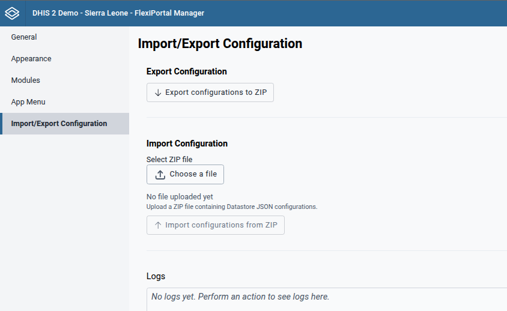

# Export/Import Configuration

The **Export/Import configuration** section in **FlexiPortal Manager** allows you to exports or imports your configurations.

###  Export Configuration

This feature allows you to export the current configuration of your FlexiPortal instance into a `.zip` file. It is especially useful for:
- Creating backups
- Transferring configurations between instances

###  Import Configuration

This functionality enables you to restore or apply an existing configuration from a `.zip` file.

**Steps:**

1. Click **“Select File”** and choose the `.zip` configuration file.
2. Click **“Import Configuration from ZIP”**.
3. The imported configuration will be applied immediately, and the portal will start using the new configuration imported.

:::warning

When importing a configuration into a new instance, ensure that all referenced metadata required by the configuration is already present in the target instance.

For example, the configuration may reference specific document IDs (such as icons, SVGs, or other assets). If these referenced items are missing, it may result in errors.

:::

### Logs
:::tip  

You can refer to the log information to verify the success or failure of the export/import process.

:::
