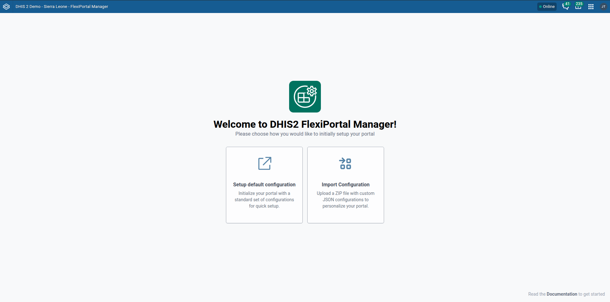
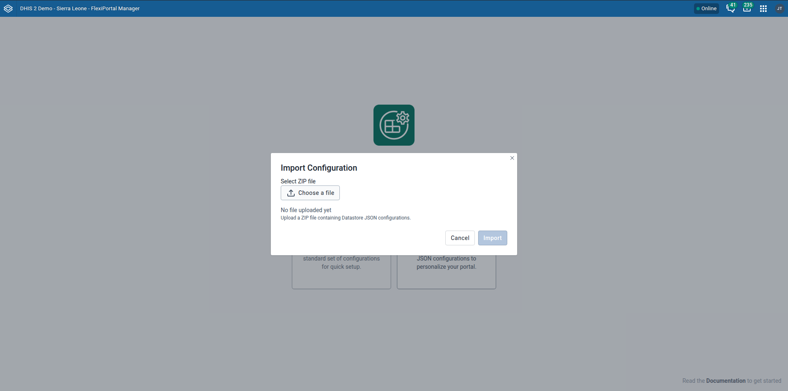

# Introduction

The DHIS2 Public Portal can be configured through the Manager App. This section provides documentation on how to configure various aspects of the portal app, including:

- **General Settings**: Configure basic information about the portal, such as name, description, and application URL.
- **Appearance**: Customize the look and feel of the portal, including colors, logos, header, and footer.
- **Menu**: Configure the navigation menu of the portal, including its position, items, and structure.
- **Modules**: Configure the different modules available in the portal, such as visualizations, documents, and more.

The following sections provide detailed instructions on how to configure each aspect of the portal app.
## Initial Configuration Setup

After installing and launching the application, FlexiPortal provides two options for setting up your configuration:

- **Setup Default Configuration**
- **Import Configuration**

### Setup Default Configuration

This option loads predefined settings to help you quickly get started without any prior configuration.

Key default sections include:

- **Appearance** – Default logos, theme colors, chart colors, headers, and footer links.
- **General** – App name, description, icons, and application URL.
- **Menu** – Preconfigured menu layout and position.
- **Modules** – Comes with a default home module.

These settings offer a solid foundation that can be customized later to suit your specific requirements.

### Import Configuration

Use this option if you already have a configuration `.zip` file to apply.

**Steps:**

1. Click the **“Import Configuration”** button.

   

2. Select your `.zip` configuration file.

   

3. The configuration  will be applied to your instance.

---
:::warning

When importing a configuration into a new instance, ensure that all referenced metadata required by the configuration is already present in the target instance.

For example, the configuration may reference specific visualizations. If these referenced items are missing, it may result in errors.

:::
