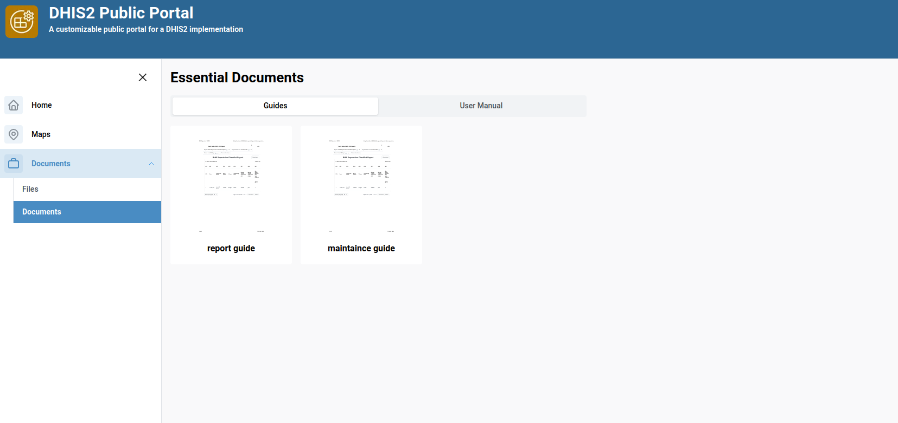
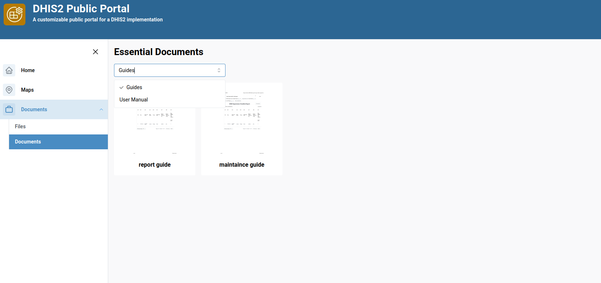
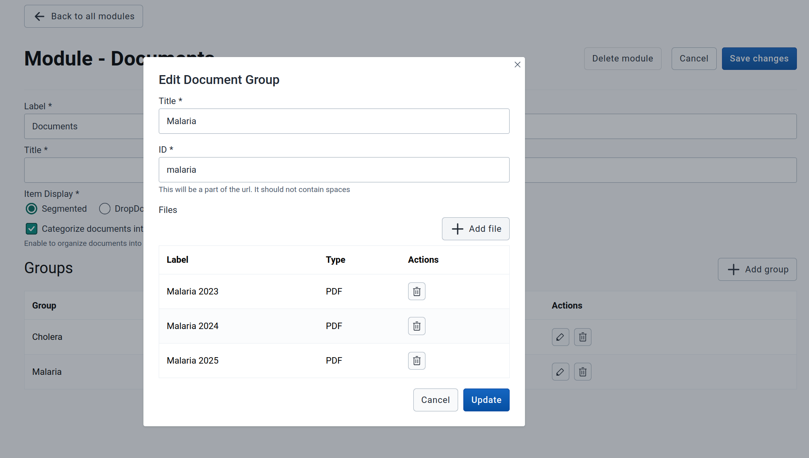

# Document Module

## Overview
The Document Module is designed to showcase and manage documents or files through a configurable and responsive interface. This guide outlines how to create and configure a Document Module for both flat (ungrouped) and grouped document displays.

---

## 1. Document Module Creation

Click the **Create a new module** button to initiate the creation process. A form will appear prompting you to enter:

- **Label** – A short, user-friendly name for your module.
- **Type** – Select `"Document"` from the type options.
- **ID** – Auto-filled from label (used in URL paths; must contain no spaces).

> **Note:** The **Label** can be a short display name, while the **Title** (configured later) is more descriptive.

Once completed, click **Create** to proceed to the module configuration screen.

---

## 2. Configuration

###  General Configuration

In the **General Configuration** section, you can set:

- **Label** – Short identifier for the module (editable).
- **Title** – Descriptive name shown in the portal.
- **Item Display** – How grouped documents are displayed:
  - **Segmented**
  - **Dropdown**

> Example of segmented display:
> 

> Example of Dropdown display
> 

- **Categorize documents into groups** – Toggle for grouping documents.
  - Unchecked (Flat Mode): Documents are listed directly.
  - Checked (Grouped Mode): Documents are organized into groups.

---

## 3. Flat Configuration (When 'Categorize documents into groups' is Unchecked)

When **Categorize documents into groups** is **unchecked**, the module behaves in a flat mode. You will see:

- A button labeled **Add Document**  
- A list of documents added to the module if any

###  Adding a Document

Click **Add Document** to open the document form. Fill in the following fields:

- **Label** – Name of the document
- **ID** – Auto-filled from label (used for URL)
- **File Type** – Currently only **PDF** is supported
- **Upload File** – Select and upload the PDF file

You can add multiple documents. Each added document will appear in the list below.

---

## 4. Grouped Configuration (When 'Categorize documents into groups' is Checked)

When **Categorize documents into groups** is **checked**, the module allows organizing documents into user-defined groups.

###  Adding a Group

Click the **+ Add Group** button. A form will appear where you provide:

- **Group Title** – Display name for the group
- **ID** – Auto-generated from the title

After group creation, a new section appears allowing you to add documents to that group.

###  Adding Files to a Group

Within each group, click **Add File**. Fill in:

- **Label** – Name of the document
- **File Type** – PDF only
- **Upload File** – Choose the document file

You can add multiple files before saving the group.

> Group Creation Modal:
> 

Once saved, the group and its files will appear below.

---

## 5. Deleting or Saving a Module

At the top of the module page, you will find buttons to:

- **Save Changes** – Save all configuration updates
- **Delete Module** – Remove the entire module and its contents

> ⚠️ **Warning:** Deleting a module permanently removes all files and groups associated with it.

---

## 6. Summary

| Feature               | Description                                          |
|-----------------------|------------------------------------------------------|
| **Create Module**     | Define label, type (`Document`), and ID              |
| **Item Display**      | Choose between Segmented or Dropdown view for grouped documents          |
| **Flat Mode**         | List of documents without grouping                  |
| **Grouped Mode**      | Organize documents into titled groups               |
| **Add/Edit/Delete**   | Full CRUD support for files and groups              |
| **PDF Support Only**  | Currently supports only PDF file type               |
 
---

## 7. Best Practices

- Use **URL-safe IDs** with no spaces or special characters.
- Organize documents into **meaningful groups** when grouping is enabled.
- Save your progress frequently.
- Preview your display modes (Segmented vs Dropdown) for usability.

> 💡 Got ideas or suggestions? Reach out to the team to request new features!
---
