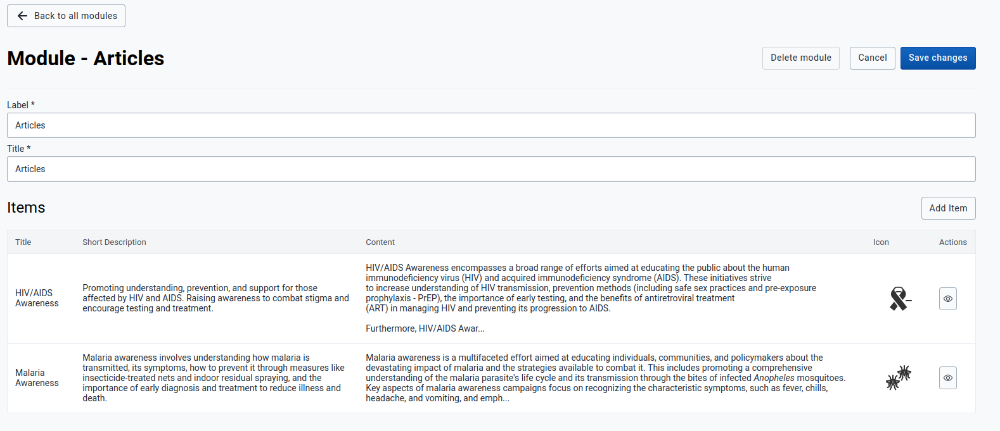
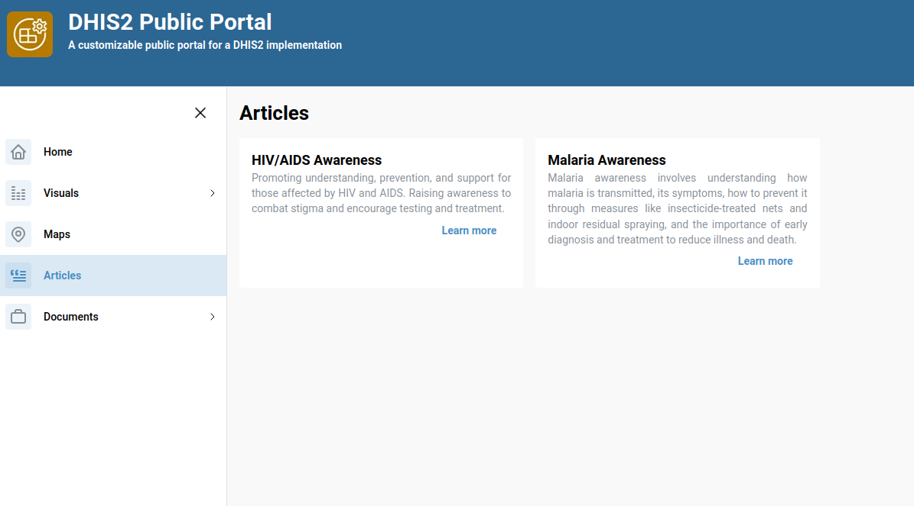

# Static Module

## Overview
The **Static Module** enables users to create and manage content-focused pages like **documentation articles**, **blog posts**, or **knowledge based entries**.

Each static module can house multiple **items**, where each item represents an independent content entry such as an article or blog post.

This guide will walk you through how to **create**, **configure**, and **manage** a static module and its content items effectively.

---

## 1. Module Creation

### Creating  New Static Modules
Within the Modules Page click **Create a new Module** to begin. You will be prompted to enter:

- **Label** – User-friendly name for your module.
- **Type** – Module type `"Static"`.
- **ID** – Auto-filled from the Label (used in the URL and must not contain spaces).

Click **Create module** to generate your static module and proceed to its configuration screen.

### Module configuration
After module creation, you’ll be directed to the **module page**, where you can customize:
- **Label**: Module name 
- **Title**: Page header title

Changes here affect how the module appears within the portal and should reflect the purpose of your content.

---

## 2. Item Management

### Adding a New Item

Inside the static module configuration screen:

- Click **Add Item** to begin creating a content entry.
- Fill in:
  - **Title** – The headline of your content.
  - **ID** – Automatically filled from the title (e.g., `getting-started` from "Getting Started").

Click **Create Item** to proceed.

###  Configuring a Static Item

After item creation, you'll be redirected to the item configuration screen. Here you can set:

- **Short Description** – A brief summary of the content.
- **Content** – The main body or article text.
- **Icon** – Upload an icon in svg format representing the item.

### Edit or Delete

Each item can be edited or deleted. To apply your changes, always click:

>  **Save Changes**

After saving, you will be redirected back to the module overview page.

> Example view:
> 

> Expected outcome:
> 
---

## 4. Use Cases 

Static modules are best used for:

- 📖 **Documentation Pages** – Add items like “How to Use”, “Getting Started”, etc.
- 📝 **Blog Entries** – Organize blog posts with rich content and icons.
- 📄 **Informational Content** – Pages like “About Us”, “FAQs”, “Policies”, etc.

Each item functions like a standalone article inside a module.

---

## 5. Summary

| Feature | Description |
|--------|-------------|
| **Create Module** | Define label and static type |
| **Add Items** | Add articles with title, content, and icon |
| **Save & Edit** | Make changes and persist them |
| **Multi-Item Support** | Add unlimited items per module |

---

## 6. Best Practices

- Keep IDs simple and descriptive — no spaces.
- Use short descriptions for quick item overviews.
- Choose relevant icons and maintain consistent icon styling.
- Always **Save Changes** before navigating away.

---

## 7. Future Enhancements

Coming soon:

- Item reordering support

> 💡 Got ideas or suggestions? Reach out to the team to request new features!

---
