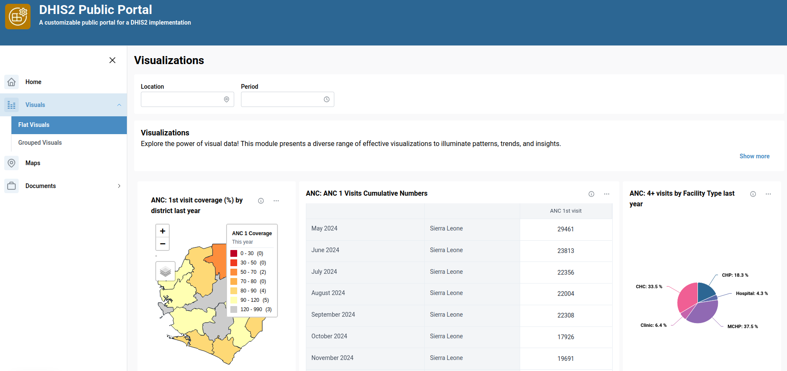

# Visualization Module

## Overview

The **Visualization Module** allows users to create and manage data visualizations through a flexible interface.

This guide covers **module creation**, **configuration**, and **management** for both simple visualizations and grouped visualization sets.

---

## 1. Visualization Module Creation

To create a new visualization module, navigate to the Modules page.

Click the **Create a new module** button to initiate the creation process. A form will appear prompting you to enter:

- **Label** – User-friendly name for your module.
- **Type** – Module type `"Visualization"`.
- **ID** – Auto-filled from label (used in URL paths; must contain no spaces).
    > **Note:** The **Label** can be a short display name, while the **Title** (configured later) is more descriptive.

Once filled, click **Create**. This opens the module configuration screen.

## 2. Basic Configuration

### Core Configuration

Configure in General configuration :

- **Label**
- **Title**
- **Short Description**
- **Description**
- **Categorize visualization into groups** (Checkbox – default: unchecked) Leave unchecked for flat/non-grouped layout.

### Adding Visualizations

Click **Manage visualization** to add new visualizations and configure their layouts. Afterwards click **Add Visualization** to add a new visualization. You must specify:

- **Type** of visualization
- **Name** of visualization
- **Caption** detailing the visualization selected

You can add as many visualizations as needed.

Once you’ve added visualizations, you can adjust and arrange visualizations for different screen sizes.

- Use the **Screen Size Dropdown** to configure layouts per device (e.g., mobile, tablet, desktop).

> Expected Outcome:
> 

## 3. Grouped Configuration

> Use this setup if you want to organize visualizations into categories or tabs.

### Group Setup

Enable **Categorize visualization into groups** checkbox

When **Categorize visualization into groups** is **checked** additional UI elements will appear:

#### Group Selector

Choose between:

- **Segmented** – Groups appear as segmented buttons
- **Dropdown** – Groups appear in a dropdown menu

### Creating Groups

Click **+ Add Group** to open a new group form

Fill in:

- **Group Title**: Display name
- **Short Name**: Compact identifier
- **ID**: Auto-filled from title
  Click **Create Group** to save it

### Group Configuration

After creating a group, configure the following:

- **Short Description**
- **Description**

You can then manage visualizations to the group using the same process:

1. **Add Visualization** – Select type, name, and caption.
2. **Configure Layout** – Adjust for screen sizes.
3. **Save Changes** – Ensure changes are applied.

You can:

- Add more groups
- Edit existing ones
- Delete unwanted groups

> Expected Outcome:
> 

---

## 4. Deleting a Module

Modules can be deleted entirely from the module overview screen.

> ⚠️ **Warning:** Deleting a module will remove all its visualizations and groups permanently.

## 5. Summary

| Feature                                  | Description                                         |
| ---------------------------------------- | --------------------------------------------------- |
| **Create Module**                        | Define label, type, and ID                          |
| **Configure Layout**                     | Customize visualization layout for multiple screens |
| **Categorize visualization into groups** | Toggle between grouped and flat visualizations      |
| **Add/Edit/Delete**                      | Full CRUD control on visualizations and groups      |
| **Responsive Design**                    | Layouts optimized per screen size                   |

---

## 6. Best Practices

- Always use URL-safe IDs (no spaces or special characters).
- Regularly save progress during configuration.
- Organize groups meaningfully when using group mode.
- Test layouts on multiple screen sizes to ensure optimal display

> 💡 Got ideas or suggestions? Reach out to the team to request new features!

---
